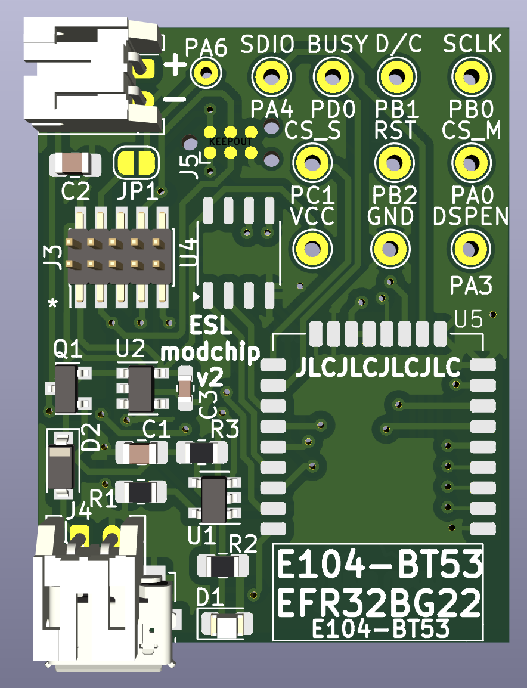
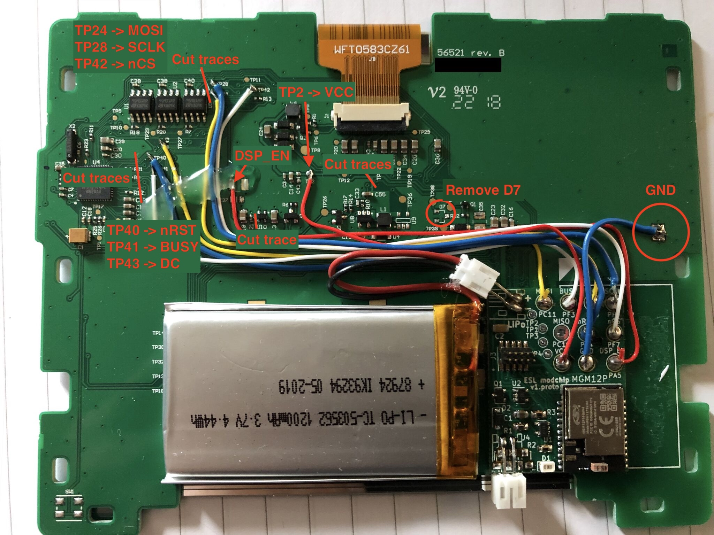

# OEPL hardware modchip for non-flashable devices, by stevew817
License: [CERN-OHL-W-2.0](https://choosealicense.com/licenses/cern-ohl-w-2.0/)

## Introduction
This is sample hardware for modding an electronic shelf label such that it supports running OpenEpaperLink (OEPL) compatible firmware. A 'brain transplant', if you will.

## Hardware
The modchip originated from a mod of a Pricer HD150 electronic shelf label, which is commonly available on eBay. These are nicely sized, at 5.83" diagonal and a 640x480 resolution. The display inside is a red/black/white eInk display made by a company called 'Good Display' ([GDEW0583Z83](https://www.good-display.com/product/242.html)). The shelf label is interesting as it seems to be in relatively steady supply, and inside it comes with a carrier PCB and injection-molded enclosure with space to spare for an invisible hardware mod.

The stock shelf label is infrared-based, and the protocol has been analyzed by other folks before me. However, for supporting OpenEpaperLink we need 2.4GHz IEEE 802.15.4-based connectivity. Thus, the modchip.

I have spent hours trying to reverse the PCB and firmware running on the chip, ending up having to build a live-surgery setup considering the stock firmware for these is in RAM. That means that when you remove the batteries, the firmware is gone. Yay. The end result is a functional hardware mod with a workable understanding of how to drive the display, which (bonus points!) fits inside the original enclosure after cutting out some plastic supports on the inside. It even supports a rechargeable battery inside the case!

As pictures say more than a thousand words, here you go:

KiCAD source files for the 'modchip' are provided in the `HD150-mod-ebyte` folder. Feel free to remix or use as-is.

### Component list for mod
- LiPo battery which fits in the enclosure space, with built-in undervoltage protection. I used [these](https://www.kjell.com/no/produkter/elektro-og-verktoy/arduino/arduino-tilbehor/luxorparts-li-po-batteri-37-v-med-kontakt-1200-mah-p87924) but have no idea where they are sourced from. A Google search would indicate PKCell. Indicated dimension 63x36x4,7 mm. The same marking code can be found on [Adafruit's battery](https://www.adafruit.com/product/258).
- Assembled PCB ([BOM](./BOM.csv))
  - Notes about the BOM:
    - Choose either a micro-USB connector or a JST-PH connector for the power input (i.e. choose either J2 or J4). The JST-PH footprint is also good for soldering a cable with a custom charging contact on to if desired.
    - JP1 is for testing purposes only. The debug UART doesn't support input, it only prints output, so the RX signal goes unused and PA06 is exposed as a solder pad for future use.
    - Either mount the mini-simplicity connector on J3 for flashing the chip with a Silicon Labs WSTK, or use a tag-connect Cortex cable (and a debug probe of your choice which supports EFR32BG22) on footprint J5.
  - Note about the [module](https://www.cdebyte.com/products/E104-BT53A1): can be sourced from [AliExpress in a 10-pack](https://www.aliexpress.com/item/4001276005199.html) for less than $2/pc.
- Electrical wire

Tools:
- Soldering iron / hot plate
- Hot glue
- Scalpel
- Side-cutting pliers

### Mod instructions for HD150
More pictures...

Cutting the original PCB traces, plus wiring and mounting the mod and the battery:

Removing elements from the back casing to make room for the mod:

In writing:
- Open the HD150 casing using a thin metal opening tool. It has clips all around the case. You could use a knife, but I fully recommend using something less prone to cause injury, such as [iFixit's Jimmy](https://www.ifixit.com/products/jimmy).
- Remove the carrier PCB from the housing. This is done best through releasing the 2 gripper hooks in one corner first, and then the other corner.
- Cut the traces along the red line as indicated on the picture above.
- Affix the modchip with a dot of hot glue in the location as shown in the picture above.
- Wire the testpoints to the pads on the modchip as indicated in the picture above.
- Affix the wires with some hot glue.
- On the back plastic housing, remove the original battery modules and cut away the enclosure walls in the places where the wires and the battery pack would go. Side-cutting pliers are the tool of choice here. See the picture above for visual instructions.
- Cut an opening in the back housing for the modchip's programming and charging connectors if you want to be able to reflash without having to disassemble the housing again. Using a scalpel works, but melting a hole would probably be easier/faster. Again, see the picture for visual instructions.
- Reinstall the display PCB into the back housing.
- Click the front housing frame in place again.

## Firmware
The firmware is built as part of the EFR32xG22 implementation of OEPL, residing in a [separate repository](https://github.com/OpenEPaperLink/Tag_FW_EFR32xG22). Note that if you want the modchip to support a different display than the HD150/GDEW0583Z83, you'll need to either implement support for that yourself (and please send a PR!), or open an issue with your request (not guaranteed to be followed up on, depends on available time and access to hardware).
